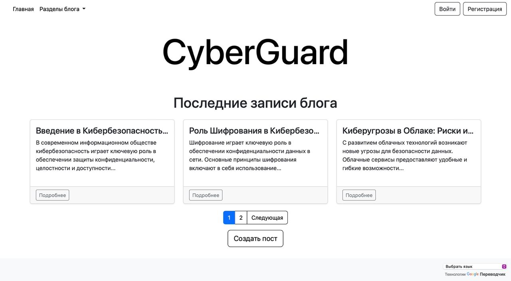
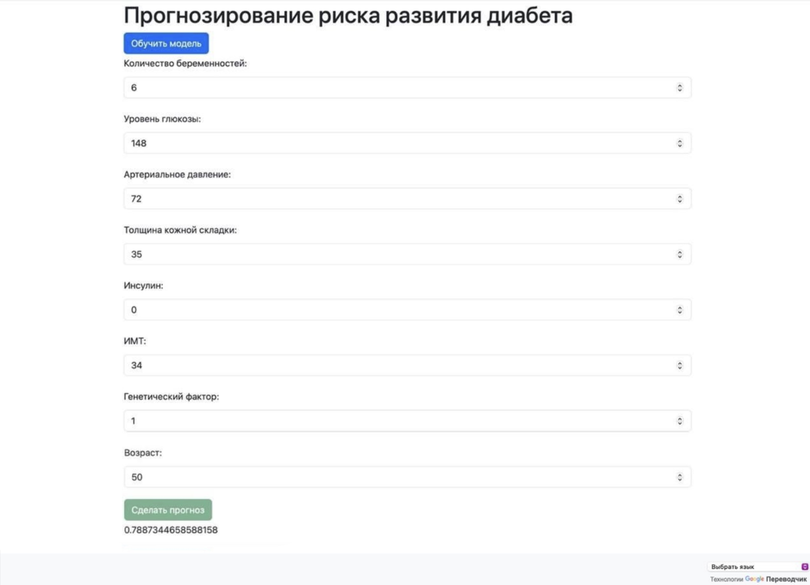

# GeekGenius Django Blog


**GeekGenius** — это проект блога на основе Django, разработанный для предоставления платформы, на которой пользователи могут создавать и публиковать свои записи в блогах. Этот README-файл содержит инструкции по настройке и запуску проекта как на локальном компьютере, так и с использованием Docker.



# '

## '
## Предварительные требования

Перед началом работы убедитесь, что на вашем компьютере установлены следующие компоненты:

- Python 3.x
- pip
- Docker
- Docker Compose

## Переменные окружения

Проект использует переменные окружения для настройки. Задайте следующие переменные перед запуском проекта:

### Установка зависимостей

Создайте виртуальное окружение и установите необходимые пакеты Python:

```sh
python3 -m venv venv
source venv/bin/activate
pip install -r requirements.txt
```

### Применение миграций

```sh
python manage.py migrate
```

### Запуск сервера для разработки

Вы можете запустить проект, используя либо run.py, либо через Flask CLI.

Используя run.py

```sh
python run.py
```

Используя Flask CLI

```sh
flask run --port=8000
```

После этого вы сможете открыть блог по адресу `http://127.0.0.1:8000`.

## Настройка Docker

### 1. Сборка и запуск контейнеров Docker

Убедитесь, что у вас установлены Docker и Docker Compose. Затем выполните следующие команды:

```sh
docker-compose up --build
```

Эта команда соберет образы Docker и запустит контейнеры, как это указано в файле docker-compose.yml.

### 2. Импорт данных в phpMyAdmin

Чтобы импортировать начальные данные, выполните следующие шаги:

1. Откройте веб-браузер и перейдите по адресу `http://localhost:8080`.
2. Войдите в phpMyAdmin, используя учетные данные, указанные в файле `docker-compose.yml`.
3. Выберите соответствующую базу данных.
4. Перейдите на вкладку «Импорт».
5. Выберите SQL-файл из каталога [DB.sql](..%2FDB.sql)sql_data и начните импорт.


## Дополнительные замечания

- Обязательно настройте файл blog/settings.py в соответствии с вашим окружением (например, параметры базы данных, допустимые хосты и т. д.).
- Используйте файл .env для управления конфиденциальными данными и настройками, которые специфичны для конкретного окружения.